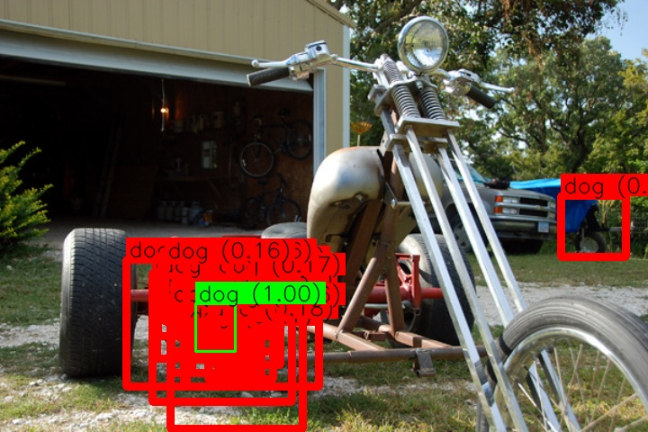

# GLIP-Simple
A streamlined, from-scratch implementation of [GLIP (Official Repo)](https://github.com/microsoft/GLIP) focusing on core functionality and readability.

## 🤔 Why This Repo?

While the official GLIP implementation is powerful and feature-rich, its complexity can make it challenging to:
- Understand the core architecture
- Implement the key concepts

This repository provides:
- Clean, modular implementation of GLIP's core components
- Simplified codebase without extra configurations
- Direct logit-based visualization and inference
- Easy-to-use dataloader for open-vocabulary detection

## Original vs Simplified

Below table shows comparison of original and this implemntation.

| Feature | Original | Simplified |
|---------|----------|------------|
| Config Dependencies | Complex CFG system | Simple parameters |
| Code Size* (only core model) | 500+ lines | ~150 lines |
| Setup Complexity | High | Low |
| Core Functionality | ✅ | ✅ |
| V+L Fusion | ✅ | ✅ |
| Token Projection | ✅ | ✅ |
| Multi GPU training | ✅ | ❌ (not yet) |

Lines is provided solely to illustrate relative complexity rather than anything serious.


## Training

```bash
# Install requirements
pip install -r requirements.txt

# Train on your dataset
python trainer.py
```


## Qualitative Results

Left, when the model just start training it produces mostly random boxes, right prediction results after 30 epochs.

<div align="center">
  
  
</div>


<div align="center">
  
  
</div>


## 📖 References

- [GLIP Paper](https://arxiv.org/abs/2112.03857)
- [Official Implementation](https://github.com/microsoft/GLIP)